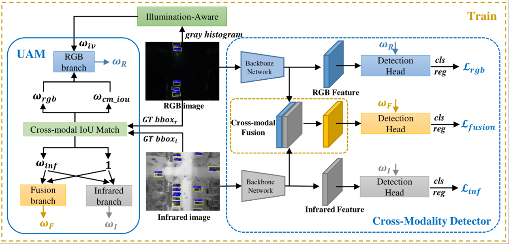

# UA-CMDet

This is the official repository for “Drone-based RGB-Infrared Cross-Modality Vehicle Detection via Uncertainty-Aware Learning” (IEEE T-CSVT 2022).

## Abstract

Drone-based vehicle detection aims at detecting vehicle locations and categories in aerial images. It empowers smart city traffic management and disaster relief. Researchers have made a great deal of effort in this area and achieved considerable progress. However, because of the paucity of data under extreme conditions, drone-based vehicle detection remains a challenge when objects are difficult to distinguish, particularly in low-light conditions. To fill this gap, we constructed a large-scale drone-based RGB-infrared vehicle detection dataset called DroneVehicle, which contains 28, 439 RGB-infrared image pairs covering urban roads, residential areas, parking lots, and other scenarios from day to night. Cross-modal images provide complementary information for vehicle detection, but also introduce redundant information. To handle this dilemma, we further propose an uncertainty-aware cross-modality vehicle detection (UA-CMDet) framework to improve detection performance in complex environments. Specifically, we design an uncertainty-aware module using cross-modal intersection over union and illumination estimation to quantify the uncertainty of each object. Our method takes uncertainty as a weight to boost model learning more effectively while reducing bias caused by high-uncertainty objects. For more robust cross-modal integration, we further perform illumination-aware non-maximum suppression during inference. Extensive experiments on our DroneVehicle and two challenging RGB-infrared object detection datasets demonstrated the advanced flexibility and superior performance of UA-CMDet over competing methods.



## Requirements
- Ubuntu 18.04
- CUDA 10.0
- NCCL 2+
- GCC 4.9+
- PyTorch 1.1
- Python 3.7
- torchvision 0.3
- mmcv 0.4.3

## DroneVehicle Dataset

[DroneVehicle](https://github.com/VisDrone/DroneVehicle) dataset is available now.  

## Citation

Please cite this paper if you want to use it in your work.

```
@ARTICLE{sun2020drone,
  title={Drone-based RGB-Infrared Cross-Modality Vehicle Detection via Uncertainty-Aware Learning}, 
  author={Sun, Yiming and Cao, Bing and Zhu, Pengfei and Hu, Qinghua},
  journal={IEEE Transactions on Circuits and Systems for Video Technology}, 
  year={2022},
  volume={},
  number={},
  pages={1-1},
  doi={10.1109/TCSVT.2022.3168279}
}
```
